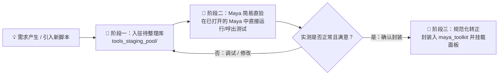
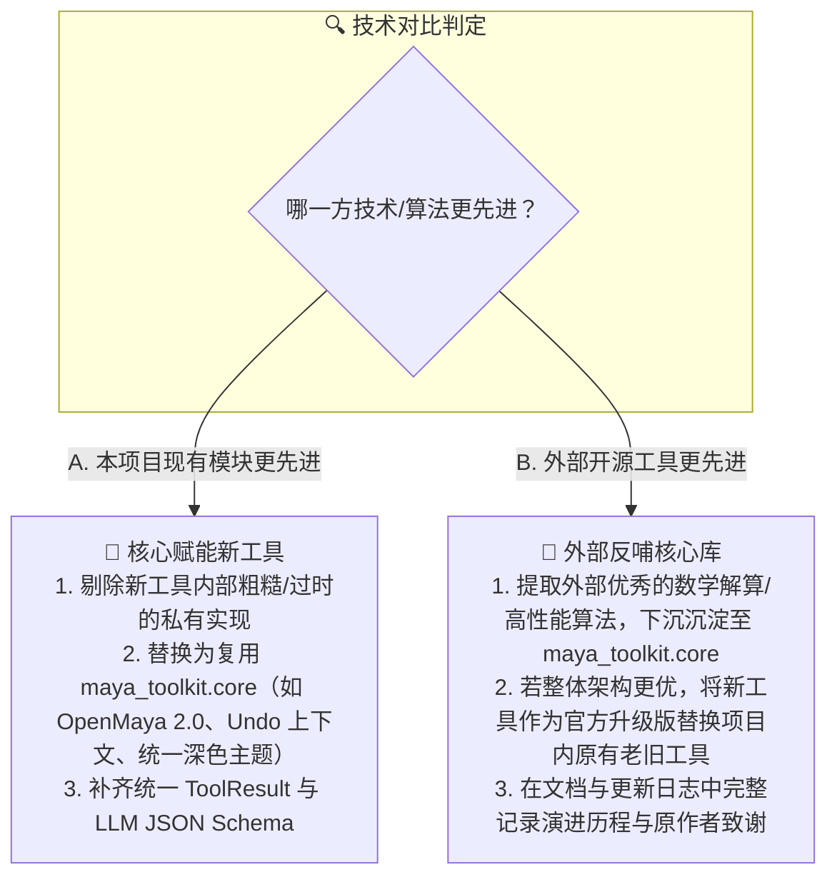

# 项目开发规则与代理工作指南 (AGENTS.md)

本文件规定了本项目的核心开发原则、新工具准入工作流及 AI 代理行为规范。所有参与本项目的 AI 代理和开发者均须严格遵守。

---

## 📌 核心准则：新工具生命周期与准入规范 (Tool Lifecycle & Staging Rule)

本项目实行明确的**“双阶段渐进演进机制”**，严禁未经实测直接将实验性代码直接打包进生产库：

### 1. 阶段一：新工具必须先入驻待整理库 (`tools_staging_pool/`)
- 凡是新开发的原型工具、新收集的零散脚本、未定型的功能实验代码，**必须首先放置在 `tools_staging_pool/` 对应的分类目录中**（如 `01_animation/`、`03_transforms_modeling/` 等）。
- 在此阶段，以保证代码完整性、携带必要素材/配置文件为主，**暂不需要立即进行深度重构或继承复杂架构**。

### 2. 阶段二：轻量直验原则（直接在 Maya 中执行测试）
- **测试方式保持最精炼直观**：无需提前编写繁重的抽象自动化测试。
- **直验标准**：直接在已打开的真实 Maya 实例中（通过 Script Editor、MEL 快捷命令、或 Maya MCP 接口）直接执行该 Python/MEL 脚本：
  1. 验证界面是否能顺利打开无异常闪退；
  2. 验证核心按钮和滑动条是否正常响应；
  3. 验证对场景对象的选中与操作是否符合预期；
  4. 观察 Maya Script Editor 是否有致命报错 (Error/Fatal Traceback)。

### 3. 阶段三：确认无误后方可封装转正 (`maya_toolkit/tools/`)
- **只有在阶段二通过 Maya 实测、确认没有问题后，才能启动正式封装**。
- 正式封装迁移至 `maya_toolkit/tools/` 时必须满足以下五项规范：
  1. **继承标准基类**：继承自 `maya_toolkit.framework.base_tool.BaseMayaTool`；
  2. **统一协议输出**：执行入口统一为 `run(**kwargs) -> ToolResult`，规范返回 `success`, `data`, `message`, `errors`；
  3. **大模型 Schema 支持**：通过 `get_schema()` 提供入参字段定义、类型与默认值，支持 LLM/Agent 无缝调用；
  4. **无副作用预检**：核心操作必须支持 `dry_run=True` 预检模式，以及 `UndoChunk` 安全撤销；
  5. **集成与自动化回归**：编写 `tests/test_<tool_id>.py` 单元测试，并将工具自动挂载到综合启动器 `maya_toolkit.show_ui()` 面板。

---

## 🔄 核心准则二：开源工具吸纳与双向技术迭代机制 (Open-Source Ingestion & Bidirectional Evolution)

本项目定位为一个**长青、可持续演进的工业级工具箱体系**。对于从 GitHub、Highend3D 等外部社区引入的开源工具或自研新模块，实行**“双向技术比对与择优替换”**原则：

### 1. 外部开源工具吸纳入驻流程
1. **原样归档待整理库**：首先将开源工具放入 `tools_staging_pool/` 对应分类目录，完整保留其原作者署名、开源许可证（MIT/GPL/Apache等）及使用说明；
2. **轻量 Maya 验证**：在已打开的 Maya 中直接运行测试，确认核心逻辑与功能可用；
3. **技术代际差深度比对 (Gap Analysis)**：将该工具与本项目现有模块（`maya_toolkit.core`、同类 `tools`）进行多维度技术对比。

### 2. “先进性”评估基准
- **API 性能与现代度**：OpenMaya 2.0 (C++ 级性能) 优于传统 `maya.cmds` / `mel` 字符拼装；
- **数学严密性**：四元数/旋转矩阵解算优于欧拉角计算（消除万向节死锁）；
- **执行安全性**：支持 `dry_run` 预检与标准原子化 `UndoChunk` 优于破坏性直写；
- **环境跨度**：兼顾 Python 2.7 / 3.7~3.11 跨版本与 Headless 无界面运行；
- **AI 与大模型友好度**：执行入口具备清晰的入参 JSON Schema 与无界面执行入口，大模型可单行调用。

---

## 🛠️ 现有核心架构简述

- `maya_toolkit/core/`：公共底层复用库（几何、DAG、Undo 上下文、字符串、深色 UI 主题、日志收集）。
- `maya_toolkit/framework/`：基础协议与调度层（`BaseMayaTool`、`ToolResult`、`ToolRegistry`、`executor`）。
- `maya_toolkit/tools/`：正式生产工具层（已转正的标准化工具）。
- `maya_toolkit/ui/`：统一启动器主界面（`maya_toolkit.show_ui()`）。
- `tools_staging_pool/`：待整理工具库（包含 8 大分类、54 项待转正储备工具）。

---

## 🌐 语言与交流偏好
- 遵循用户的全局规则：默认使用**简体中文 (Simplified Chinese)** 进行交流、解释与总结。
- 变量名、类名、终端命令与标准专业技术名词保持原汁原味的英文。
