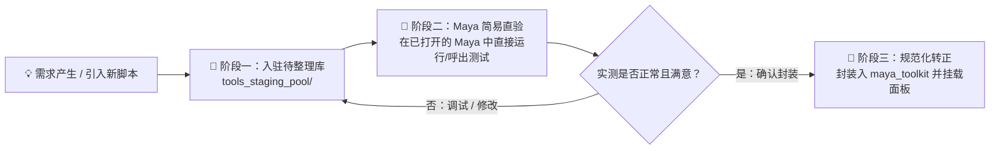

# 个人 Maya 工具知识库开发规则与代理工作指南 (AGENTS.md)

本项目用于持续整理用户自己编写的 Maya 旧脚本与新工具。目标是让工具共享 `maya_toolkit.core`，通过统一 API 调用，并以结构化说明帮助大模型检索、理解和组合功能。本文件规定准入流程与代理行为规范。

---

## 📌 核心准则：三步工具准入流程 (Tool Lifecycle & Staging Rule)

项目使用待整理库和正式工具库两层存放位置，按**入库、Maya 直验、转正**三步推进。未经真实 Maya 验证，不得将实验代码直接纳入正式工具库：

```mermaid
flowchart LR
    A["💡 需求产生 / 引入新脚本"] --> B["📁 阶段一：入驻待整理库<br>tools_staging_pool/"]
    B --> C["🧪 阶段二：Maya 简易直验<br>在已打开的 Maya 中直接运行/呼出测试"]
    C --> D{"实测是否正常且满意？"}
    D -- "否：调试 / 修改" --> B
    D -- "是：确认封装" --> E["🚀 阶段三：规范化转正<br>封装入 maya_toolkit 并挂载面板"]
```

### 1. 阶段一：新工具必须先入驻待整理库 (`tools_staging_pool/`)
- 用户自己编写的旧脚本、新工具原型与未定型功能实验，**必须首先放置在 `tools_staging_pool/` 对应的分类目录中**（如 `01_animation/`、`03_transforms_modeling/` 等）。
- 在此阶段，以保证代码完整性、携带必要素材/配置文件为主，**暂不需要立即进行深度重构或继承复杂架构**。

### 2. 阶段二：轻量直验原则（直接在 Maya 中执行测试）
- **测试方式保持最精炼直观**：此阶段无需提前编写繁重的抽象自动化测试。
- **直验标准**：直接在已打开的真实 Maya 实例中，通过 Script Editor 或 MEL 快捷命令执行该 Python/MEL 脚本：
  1. 验证界面是否能顺利打开无异常闪退；
  2. 验证核心按钮和滑动条是否正常响应；
  3. 验证对场景对象的选中与操作是否符合预期；
  4. 观察 Maya Script Editor 是否有致命报错 (Error/Fatal Traceback)。

### 3. 阶段三：确认无误后方可封装转正 (`maya_toolkit/tools/`)
- **只有在阶段二通过 Maya 实测、确认没有问题后，才能启动正式封装**。
- 正式封装迁移至 `maya_toolkit/tools/` 时必须满足以下五项规范：
  1. **继承标准基类**：继承自 `maya_toolkit.framework.base_tool.BaseMayaTool`；
  2. **统一协议输出**：子类实现 `validate(**kwargs)` 与 `execute(**kwargs)`，外部通过继承的 `run(dry_run=False, **kwargs) -> ToolResult` 或 `maya_toolkit.execute_tool(tool_id, arguments, dry_run)` 调用；
  3. **大模型 Schema 支持**：定义 `parameters_schema`（JSON Schema）；框架通过 `to_openai_tool()` / `to_mcp_tool()` 导出调用描述；
  4. **安全预检**：`validate()` 与 `dry_run=True` 不得修改场景。场景写入使用 `UndoChunk` 分组；文件写入、导出等操作另行说明其不可由 Maya Undo 撤回的影响；
  5. **知识说明与回归**：记录用途、适用条件、参数、输出、操作影响、示例及关联工具；编写 `tests/test_<tool_id>.py`，并接入 `maya_toolkit.show_ui()` 面板。框架和文档规范详见 `DEVELOPMENT_SPEC.md`。

---

## 🔄 核心准则二：自有工具之间的知识复用与组合

1. **先比对再迁移**：整理旧工具时，先识别与 `maya_toolkit.core`、现有正式工具重复的能力；通用部分下沉到 `core`，工具只保留具体业务逻辑。
2. **记录可组合信息**：每个转正工具的说明应写清输入、输出、适用条件、场景或文件影响，以及可衔接的其他工具。大模型可以据此先选择工具，再生成调用参数和组合步骤。
3. **保留可追溯的演进记录**：功能替换、接口变动与算法升级记录在工具文档中。不要为了统一架构而未经直验改变旧工具行为。
4. **按实际需求优化**：优先考虑正确性、可撤销性、跨版本实测结果和复用价值；不预设某一种 Maya API 在所有场景下都更快或更合适。

---

## 🛠️ 现有核心架构简述

- `maya_toolkit/core/`：公共底层复用库（几何、DAG、Undo 上下文、字符串、深色 UI 主题、日志收集）。
- `maya_toolkit/framework/`：基础协议与调度层（`BaseMayaTool`、`ToolResult`、`ToolRegistry`、`executor`）。
- `maya_toolkit/tools/`：正式生产工具层（已转正的标准化工具）。
- `maya_toolkit/ui/`：统一启动器主界面（`maya_toolkit.show_ui()`）。
- `tools_staging_pool/`：自有旧脚本与新原型的待整理库（当前收纳 8 大分类、109 项开源待整理工具，另有独立闭源工具池 18 项）。

---

## 🌐 语言与交流偏好
- 遵循用户的全局规则：默认使用**简体中文 (Simplified Chinese)** 进行交流、解释与总结。
- 变量名、类名、终端命令与标准专业技术名词保持原汁原味的英文。

## 🧩 Agent Skills 装配
- 为项目工具建立功能目录、任务 Skill、组合配方或安装入口时，先阅读 [Agent Skills 装配规范](docs/AGENT_SKILLS_ASSEMBLY_SPEC.md)。
- 采用“任务 Skill → 功能契约 → 工具实现 → API”组织；按工具和 API 保留检索视图。Skill 安装不改变工具生命周期或 Maya 验证状态。
- 一次任务允许组合多个 Skill、工具和 API。结果记录与同类实现优先级更新默认在后台进行，不逐次询问；只有实际需要用户干预时才提问，按装配规范保留事实、反馈与评分依据。
- 不同 Agent 使用同一包规格与记录协议；安装按目标客户端适配，并分别验证发现、读取和选择行为，不能仅凭复制成功报告全部兼容。
- 装配规范中标记为拟新增的目录与接口属于建设方案；实现前不得声称已支持自动装配、安装或跨工具执行。

## 🗂️ Obsidian 知识库同步
- 项目根目录可作为 Obsidian Vault，入口为 knowledge/00-首页.md。
- 在新电脑上安装 Vault、插件和项目级 MCP 连接时，按 OBSIDIAN_SETUP.md 操作；本机令牌和配置不随 Git 同步。
- 修改工具代码、框架、待整理库或说明文档后，运行 scripts/sync_obsidian_knowledge.py 更新 knowledge/_generated/。若后台监视进程正在运行，会自动更新。
- knowledge/_generated/ 是生成结果，不直接手工编辑；实际功能与已验证的组合关系写入 docs/tools/ 的专项知识说明。
- 总览中的代码依赖来自静态 import，不等于 Maya 实测通过或功能已可组合。
