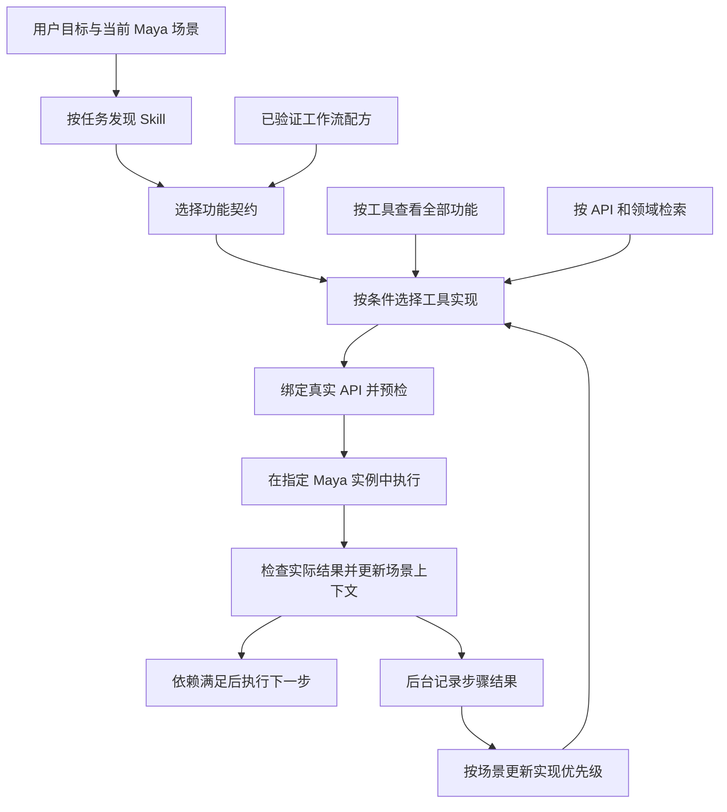

# Maya 工具与功能的 Agent Skills 装配规范

> 版本：v1.1；日期：2026-10-09。
> 用途：指导 Agent 将本项目的工具知识组织为统一、可选择、可组合、可安装的 Skills。
> 状态：设计与实施规范。已规定跨 Agent 装配、客户端安装验收、后台结果记录与优先级更新；对应装配器、安装器、记录器和评分器尚未实现。
> 前置规则：[AGENTS.md](../AGENTS.md) 与 [DEVELOPMENT_SPEC.md](../DEVELOPMENT_SPEC.md)。工具仍按“待整理 → Maya 直验 → 转正”推进，安装 Skill 不改变工具的验证状态。

## 1. 推荐方案与三个方向的关系

采用 **任务 Skill → 功能契约 → 工具实现 → API 调用** 的组织方式，并把经过验证的组合沉淀为工作流配方。

对用户，以“修复旋转跳变”“传递蒙皮权重”“准备 FBX 导出”等目标发现 Skill；对 Agent，以功能的条件和结果选择实现；对执行层，使用稳定 API；对维护者，保留按原工具查阅全部功能的视图。

| 方向 | 优点 | 局限 | 本项目中的位置 |
| --- | --- | --- | --- |
| 1. 按工具配置 Skill | 原配置、依赖和操作经验集中；适合明确指定 Animo 等套件的需求；容易追溯来源 | 用户需要知道工具名；同类功能重复；大型套件入口拥挤；跨工具选择仍需另写规则 | 保留工具视图；必要时建立专用 Skill |
| 2. 拆分功能，按相似功能装配 Skill | 更贴近自然语言需求；能比较不同实现；支持跨工具组合 | 名称相似不代表输入、效果或参数等价；拆得过细会产生大量 Skill | 作为功能目录的主体；按可交付任务聚合成 Skill |
| 3. 按 API 分类整理 Skill | 参数和调用明确；有利于自动化、版本校验与重复执行 | API 常缺少使用判断；一个 API 可能提供多个动作；很多内部 API 没有独立业务意义 | 作为实现绑定和技术检索维度 |
| 4. 按完整任务或工作流组织 | 能交付结果，包含选择、执行、检查与恢复；用户不用理解工具结构 | 巨型任务 Skill 容易覆盖过广；流程需维护依赖与验收条件 | 推荐的默认入口；只为稳定、常用任务建立工作流 Skill |

“同一个工具里的 Skill 肯定可用”需要修正为：**同一工具通常共享环境，但每个入口仍有自己的前提和验证范围。** 同套件的按钮、滑块、动画层操作、文件操作及 UI 延迟回调，也可能不能直接衔接。

如果方向 3 指的是按 `maya.cmds`、OpenMaya、MEL 分类，它更适合作为开发标签；如果指的是按公开业务 API 分类，它属于推荐方案的执行层。不要把所有 `core` 辅助函数逐一生成为面向美术任务的 Skill。

这份分层方案是结合本项目提出的设计，不是 Agent Skills 标准强制的架构。

## 2. 概念与边界

| 概念 | 回答的问题 | 例子 |
| --- | --- | --- |
| Tool | 哪个现有工具提供实现？ | `fix_rotation_winding`；Animo 候选套件 |
| Capability（功能） | 在什么条件下完成什么操作，并保证什么结果？ | 修复旋转曲线中 360 度整数倍跳变 |
| Provider（实现） | 这个功能由哪个入口、版本和参数映射完成？ | `fix_rotation_winding` 的正式 API 入口 |
| Skill | Agent 如何理解需求、选择功能、执行并检查结果？ | `maya-fix-rotation-winding` |
| Workflow（配方） | 多个功能如何按依赖顺序协作？ | 修复指定控制器旋转后，导出包含它们的动画选择集 |



这些关系允许多对多：一个 Tool 提供多个 Capability；一个 Capability 有多个 Provider；一个 Skill 包含若干相关 Capability；一个 Provider 也可供多个 Skill 使用。共享记录只有一个权威来源，打包时可以生成所需副本。

**一次任务可以跨多个 Skill、多个工具和多个 API。** “选择实现”针对当前步骤；同类实现通常择优使用，互补功能按依赖组合。任务开始时固定选择依据，后台更新优先级主要作用于后续任务；当前流程只有在条件变化或失败已妥善处理时重新选择。

安装知识包、安装 Maya 工具运行环境、建立 Agent 到 Maya 的连接，是三件分别验收的工作。Skill 已被发现，不能证明工具可执行；API Schema 已导出，也不能证明已有可连接的 Maya MCP 服务。

## 3. 当前项目已经具备与仍需建设的部分

已具备：

- `maya_toolkit.execute_tool(tool_id, arguments, dry_run)`、`ToolRegistry`、`BaseMayaTool` 与 `ToolResult`。
- 六个正式工具的注册入口；OpenAI / MCP 参数 Schema 导出，详见 [API 速查](llm_tools_cheatsheet.md)。
- [工具知识卡模板](tools/_tool_knowledge_template.md)、专项文档与 Obsidian 静态生成器。
- Animo 的固定 operation ID 和 [功能索引](tools/animo/INDEX.md)，可作为拆分功能的资料；[候选说明](tools/animo.md) 明确记录尚未完成 Maya 人工检验。

仍需建设：语义功能目录、实现选择规则、Skill 生成与安装工具、跨客户端安装适配、结果事件记录器、优先级评分器、组合验收记录，以及真实 Maya 执行连接。`knowledge/relations.json` 当前的 `verified_workflows` 为空。

当前框架不会自动按参数 Schema 校验，也不会自动解析工具知识卡。以下契约、路由和组合规则须先作为 Agent 操作规范使用；以后实现自动化时，再增加相应校验，不能仅写文档就声称已经支持。

## 4. 功能拆分与 Skill 粒度

### 4.1 功能拆分标准

一个 Capability 对应一个可描述、可观察的业务结果。能独立调用、独立判断前提、独立验收，才适合单独列为功能。

- 相同操作仅改变轴向、比例、时间范围或预设，优先记为参数或 variant，不为每个按钮建立一个 Skill。
- `diff_only` 与 `sync_materials` 的效果、写入范围不同，即使共用 `compare_and_sync_fbx`，也应分别描述为功能。
- 镜像“姿态”和镜像“动画”涉及的结果不同，应区分；Rig 名称规则与骨骼对称关系继续作为实现前提。
- 打开 UI 是可用的入口类型，但窗口打开不等于业务操作完成；纯 UI 功能标记为交互使用。
- 读写文件、安装运行环境、改偏好设置与改场景的影响不同，分别记录，不合并为一个无差别的 execute。

发现相似功能时，先比较处理对象、时间范围、空间、单位、算法限制和输出，随后决定是同一契约的不同实现，还是仅有相关标签的不同功能。不得仅凭名称、目录或 import 关系合并。

### 4.2 Skill 聚合标准

先用最小的实际任务边界。一个功能足以交付结果时，Skill 可以只包含该功能；同类实现数量增加后，补充选择表。多个功能只有在共同服务一个稳定目标时，才聚合为工作流 Skill。

例如：`maya-transfer-skin-weights` 可以收纳满足明确前提的权重传递实现；旋转跳变修复不应默认加入“平滑全部曲线”。六个业务领域可作目录索引，不必直接变成六个包揽所有工具的巨型 Skill。

默认安装任务 Skills。工具专用 Skill 仅在用户常按工具名请求、需要复杂原生配置，或套件自身提供独特完整工作流时建立。功能目录与工具视图不必各产生一整套重复 Skill。

## 5. 功能契约与实现记录的统一规格

### 5.1 功能契约

每个 Capability 必须能让 Agent 回答下表中的问题；不适用的字段明确写“不适用”，未知字段保留 unknown，不能用猜测补全。

| 字段 | 必须描述的内容 |
| --- | --- |
| `capability_id`、`contract_version` | 稳定语义 ID 与契约版本，例如 `animation.rotation.fix_winding`；不把供应方名称写入语义 ID |
| 用途与边界 | 触发需求、预期结果、不处理的问题；例如修复数值跳变不保证解决全部万向锁问题 |
| 输入与前提 | 有序节点列表、组件或选择集类型；Rig、拓扑、蒙皮、动画层、锁定和引用条件 |
| 数据语义 | 世界/局部空间、角度/长度单位、帧或秒、时间范围端点、顺序和源目标角色 |
| 输出与后置条件 | 数据字段含义；修改后必须成立的场景事实；如何确认实际成功 |
| 上下文 | 读取和修改的选择、时间、通道、层、插件、文件及全局设置；失效的节点或缓存引用 |
| 影响与恢复 | 场景和文件写入范围、Undo 覆盖、部分失败与失败遗留状态、恢复办法 |
| 实现与关联 | 可选 Provider；可衔接功能与连接条件；只是相似还是已经组合验证 |

### 5.2 实现记录

每个 Provider 保存真实来源、调用方式和证据，至少包括：

| 字段组 | 内容 |
| --- | --- |
| 身份与追溯 | `provider_id`、供应工具、`tool_id`、入口或 `operation_id`、工具版本、源码与专项文档相对路径 |
| 调用绑定 | 参数 Schema 来源、默认值、参数映射、结果字段映射；禁止虚构不存在的参数 |
| 可执行方式 | `api`、`interactive_ui`、`dispatch_only` 等；同步/异步/需用户完成的步骤 |
| 依赖与环境 | Maya/Python/Qt/操作系统、插件、运行资源、许可条件；版本范围以证据为准 |
| 验证 | 验证范围、日期、输入场景、版本、结果和证据位置；代码版本或文件摘要 |
| 执行边界 | 实际 `validate()` 覆盖、尚未检查的业务前提、部分成功判据、重试条件 |

工具生命周期和功能验证分别记录：Tool 已转正不等于其所有模式、所有 Maya 版本、所有组合都已验证。验证范围至少区分 `static_review`、`offline_checked`、`maya_checked`、`workflow_checked`；这些名称是本项目拟采用的记录约定。

`workflow_checked` 绑定整条配方、具体实现和适用环境。某个参数、插件或实现版本改变后，根据影响重新确认相关证据；无影响的文档修订不需要重测全部工具。

### 5.3 与现有代码一致的记录示例

以下是**拟新增目录的最小示例**，展示 ID 与实际调用的关系；完整记录仍须补充 5.1 和 5.2 的条件、影响和验收内容。它没有经过本次 Maya 验证，也不能被当前框架当作配置读取。

```json
{
  "capability_id": "animation.rotation.fix_winding",
  "contract_version": "1.0.0",
  "summary": "修复旋转曲线中 360 度整数倍的异常数值跳变",
  "providers": [
    {
      "provider_id": "maya-tools-box.fix-rotation-winding",
      "tool_id": "fix_rotation_winding",
      "tool_version": "1.2.0",
      "lifecycle": "production",
      "execution_mode": "api",
      "binding": {
        "entrypoint": "maya_toolkit.execute_tool",
        "arguments": ["nodes", "channels", "tolerance", "time_range"],
        "schema_source": "maya_toolkit/tools/euler_winding/tool.py:EulerWindingTool.parameters_schema",
        "dry_run": true
      },
      "precheck_result_fields": [
        "target_nodes", "detected_jumps_count", "jumps"
      ],
      "verification": {
        "scope": "static_review",
        "reviewed_on": "2026-10-09",
        "maya_environment": null,
        "maya_evidence": null
      }
    }
  ]
}
```

`precheck_result_fields` 来自当前 `validate()`，不能冒充正式执行的返回字段。正式执行的字段应按 engine 实际返回核对。`lifecycle=production` 保留现有工具状态；空 Maya 证据只表示本记录未收集证据，不能反推历史上从未测试。

## 6. Agent 如何在多个实现中选择

### 6.1 选择顺序

先判断可用性和契约匹配，再比较偏好，避免用一个含糊总分掩盖缺失前提：

1. 读取用户的目标和已明确指定的工具、参数、对象范围。用户指定实现时，以该实现为候选；如果不能满足条件，说明原因和替代方案，不静默更换。
2. 检查当前 Maya 实例、工具与插件是否可用，以及验证证据是否覆盖本次操作。待整理入口只用于明确的实验/直验任务，不因被收入 Skill 自动用于正常生产操作。
3. 比较输入和后置条件。世界空间重叠点复制不能作为任意不同拓扑网格的通用权重迁移；动画层操作也不能自动替代基础动画曲线操作。
4. 在满足条件的实现中，遵守用户明确的选择与禁用设置，再使用同类功能、当前环境的历史结果排序；没有足够历史时，优先采用已验证、结果可检查、附带完整 API 的实现。性能比较依赖实际测量；不得预设 OpenMaya 总比 cmds 快。
5. 只有 UI 的实现，可以用于用户参与的交互任务；仅确认分派的入口，必须再检查业务结果。无完成信号时暂停依赖它的后续步骤。
6. 没有满足条件的实现时，说明缺少什么。可起草候选适配器或直验步骤，不把最相似入口冒充可用方案。

替换实现前检查参数映射和差异。相同名称的 `tolerance` 可能分别表示角度或空间距离；一个实现额外写关键帧、改选择或修改文件，也不是透明替换。

失败后仅在已确认无副作用，或已恢复原状态时，考虑其他实现。不得在部分场景写入后盲目切换 Provider 重做同一操作。

### 6.2 默认后台记录，按需要询问

用户已经明确选择：**正常工作时直接记录实际结果，自动优化优先级；只有确实需要用户干预时才询问。** 不逐次询问是否满意，不为每次调用弹窗，不为每次评分更新发送通知。用户主动询问时，提供记录与选择原因。

- 实际执行和任务相关检查通过后，自动记录 `verified_success` 并计入成功样本，无须用户重复确认。
- 已确认调用执行完成，但目标效果缺乏足够证据时，记录 `execution_success`；任务结果保留 `provisional_success` 或 `unknown`。无需为了填写反馈而打断用户，也不把未知效果算成已验证成功。
- 后续收到“效果不对”“重做”“以后用 A”等反馈时，关联原任务/步骤，修订结果或偏好。没有反馈仅表示反馈缺失，不伪造用户确认；单纯沉默不增加效果评分。
- 明确的运行错误、部分成功、取消和未完成 UI 操作按事实记录，不统一转成成功或失败。
- 只在缺失信息会影响结果或下一步执行、恢复需要用户决定、用户偏好无法从上下文判断，或必要权限不足时提出简短问题。询问应说明具体缺口，并继续不依赖答案的工作。

已有检查足够时不重复增加检查；不能仅为积累评分多次修改场景或重新导出。后台记录失败应保留可补写的信息，不冒充已经保存；若不影响当前 Maya 任务，可继续工作，但说明记录机制的实际缺口。

### 6.3 结果事件与归因

记录按步骤建立，可关联整条 Workflow。推荐事件字段如下；这是拟新增记录器的协议，不是当前 `ToolResult` 已提供的全部字段。

| 字段组 | 内容 |
| --- | --- |
| 身份 | `schema_version`、唯一 `event_id`、`task_id`、`step_id`、`attempt_id`、事件时间与记录来源 |
| 功能和实现 | `skill_id`、`capability_id`、`provider_id`、Tool/API 版本、契约版本、来源代码摘要 |
| 场景上下文 | Maya/插件版本、对象类型、曲线/动画层模式、空间与单位、关键参数档位；只保存选择判断所需摘要 |
| 选择依据 | 当时可用候选、被选择原因、评分策略版本、优先级快照；未知项保留 unknown |
| 执行与验收 | `dry_run`、是否实际执行、返回状态、错误/警告摘要、任务检查及证据、耗时、步骤结果 |
| 反馈与归因 | 用户反馈、是否需重做/恢复、失败原因、影响范围、相关原事件 ID；未知归因不得填成算法缺陷 |

执行结果、目标效果、用户偏好分别记录：技术成功不能代替效果满意；用户偏好也不证明环境兼容。Agent 的“我已经完成”陈述不作为独立证据，评分来源应是实际执行记录、检查结果或直接用户反馈。

区分原因：`provider_error`、`argument_error`、`environment_error`、`composition_error`、`preference_mismatch`、`unknown`。参数构建或组合错误应改进该绑定/流程，不能无依据地全局惩罚算法。用户调整需求、普通取消或无关 Undo 不视为 API 失败；Undo 只有能归因于该步骤的问题时才产生负面评价。

原始事件可追加，修订事件引用旧记录；评分器根据每个样本的最新有效结论重算，替换旧评价，不把成功和后续失败重复累加。原执行状态仍保留。例如运行完成而视觉效果失败，可以同时保持技术成功与效果失败。

同一 `task_id + step_id + provider_id + 实现版本` 的重复调用与重试默认作为一组样本，保留全部尝试，但不因循环一百次就获得一百份独立成功证据。最终检查通过而前面有重试时，效果可成功，稳定性仍保留重试代价。整项任务成功只更新流程评价；各 API 要按自己的步骤证据更新。

多 Agent 共享工作区时使用同一事件协议与受控写入，持久化时保证事件唯一、并发安全和修订可追溯。不同客户端可共享同一用户授权的结果目录；聊天上下文不能作为唯一的长期存储。

### 6.4 初始权重与更新规则

**权重只在满足契约、环境、验证范围和用户限制的候选之间排序，不能扩大执行资格。** 用户明确指定或固定优先的实现先按条件检查；用户明确禁用的实现直接排除。历史高分不替代预检，不把待整理工具自动转正，也不自动将候选流程标成已验证。

默认统计键为 `用户/项目偏好范围 + capability_id + provider_id + 实现版本 + context_profile`。`context_profile` 使用有业务意义的类别，如基础曲线/动画层、对象类型和关键环境版本，而非每个场景名称。环境与版本不兼容时，旧记录只供参考，不直接计入新版本排序；经兼容性确认的记录才可合并。

以下是 **v1 建议默认值**，用于后续评分器的明确起点，尚未通过本项目历史使用校准。权重配置、样本窗口和策略版本应可查看、可调整，Agent 不凭主观印象直接修改分数。

```text
score = 60 × R + 25 × Q + 10 × P + 5 × F
R = (2 + S_R) / (4 + S_R + N_R)
Q = (2 + S_Q) / (4 + S_Q + N_Q)
P = (1 + S_P) / (2 + S_P + N_P)
F = min(ln(1 + U_30) / ln(21), 1)
```

| 指标 | 定义与更新 |
| --- | --- |
| `R`：执行可靠性 | 最近 90 天相同统计键的实际执行样本；完成且无实现自身错误加 `S_R=1`，实现错误或由实现引发的重试加 `N_R=1`；同一样本不同时算稳定成功和失败 |
| `Q`：效果符合度 | 最近 90 天结果样本；客观任务检查通过加 `S_Q=1`；用户明确肯定该步骤效果替换为 `S_Q=2`；检查失败加 `N_Q=1`，用户明确指出该实现效果不符替换为 `N_Q=2`；效果未知不计入 |
| `P`：个人偏好 | 直接表达的实现偏好或拒用倾向，正负各记一份；普通调用、沉默或一般“完成了”不计入；“固定优先/禁用”单独作为约束处理，直至用户改变 |
| `F`：常用程度 | `U_30` 为近 30 天确认实际运行完成的独立步骤数；最多贡献 5 分，不包含 dry-run、仅分派或未完成调用；包含重试的步骤仍只计一次 |

效果负面证据还需归因：参数错误只进入该参数档位或绑定问题记录，组合错误进入 Workflow 评价；无法归因时保留问题记录，暂不把它计入实现质量的分母。技术状态已知时仍可更新相应指标。

分数是排序依据，不是成功概率。初始先验使少量样本不会立即获得满分；同时保存各项有效样本数。效果样本不足 5 组时标记“证据较少”，同等条件优先已有充分证据的实现；分差不超过 3 分时维持当前适用的默认实现，减少无收益切换。

一条任务开始时固定排序快照；步骤完成后更新记录和缓存，下一项任务采用新快照。近期结果逐渐主导排序，原始历史继续保留。严重可归因错误可立即让实现进入相应版本/场景的 `needs_recheck` 状态，并使用其他合格实现；该状态不因统计窗口过期自行恢复，须有实际复核证据。

未被选择的实现没有本次结果，不能据此扣分，也不能因 A 常用就宣称 B 更差。默认不在用户当前场景随机尝试低分或未知实现；新实现通过已有授权的直验、用户指定使用或适当的副本比较积累证据。

优先级缓存是原始结果的派生数据，可重新计算。评分配置变化、迟到反馈和版本迁移均保留策略版本，能够说明“为什么本次优先选 A”。结果记录和权重调整不更改用户场景中的业务参数，不自动重写或重装 Skill。

### 6.5 使用一周后的示例

假设同一曲线圆滑功能中，A 在一周内完成 20 个独立步骤，适用环境一致且任务检查都通过；B 只有少量可比较证据。A 会获得较充分的可靠性与效果证据，常用程度也略微加分，后续相同场景通常优先选择 A。这里只是假设案例，不表示仓库已有这两项已验证 API 或真实调用历史。

如果 A 的 20 次仅是没有报错、未检查曲线效果，则只增加执行与常用证据，效果仍未知。如果用户后来指出其中一次过度圆滑，关联那一步修订评价，并判断是参数档位、实现局限还是偏好不匹配。正常记录和重算在后台进行，不要求用户逐条评价。

## 7. 功能如何组合

### 7.1 两类连接

- **数据连接**：前一步输出文件路径、目标节点或映射，下一步作为参数使用。核对真实字段、类型、单位与语义；截断的预览列表不能作为完整输入。
- **场景状态连接**：前一步修改 Maya 场景，下一步读取修改后的节点、动画或选择集。前一步即使只返回计数，也可能能组合，但必须刷新上下文和重新预检。

“自由组合”表示可以根据契约构建新流程；新组合标记为候选，满足单步条件后进行明确的组合直验。只有记录了实际验收证据的流程，才可称为已验证配方。形式上的类型匹配不证明视觉效果或业务语义成立。

### 7.2 配方的必要内容

记录 `workflow_id`、版本、用户目标、适用条件、步骤 ID、依赖顺序、每步 Capability/Provider、参数绑定、上下文读写、完成判据、错误处理、外部文件影响与组合证据。表达独立分支时可以使用有向无环图；同一个 Maya 场景中的读写冲突步骤默认串行，不能因图上无数据边就并行执行。

普通一次性组合不需要马上编写通用工作流引擎。先把明确步骤和检查记录在文档中；重复使用、依赖关系明确后再固化为配方。

### 7.3 执行规则

1. 固定当前实例、目标对象、顺序、时间范围、空间与文件目标；优先使用显式参数。仅当实现必需时依赖当前选择，并写明恢复策略。
2. 做整条流程的静态检查，标记哪些后续前提需要前一步生成。不能把所有步骤在旧场景上的 dry-run 成功当作全流程已验证。
3. 每步执行前刷新实际上下文，调用该步预检，再执行。检查后置条件，记录实际结果后才开放后续依赖。
4. 重命名、清理命名空间、重建层级或删除节点后，重新解析节点身份。可用 UUID 加完整 DAG 路径等信息辅助，但引用重载、实例或节点重建仍需重新确认；不得拼接字符串猜新名称。
5. 单步 `ToolResult.success` 之外，再检查 `errors`、`warnings`、任务相关数据和实际结果。允许跳过或部分成功的规则必须在配方中明确。
6. 需要 UI 操作或异步完成的步骤设置完成屏障。打开窗口、提交动作、启动 timer 都不是屏障完成。
7. 失败时停止依赖分支，报告已修改的场景、已写文件和恢复方法。Maya Undo Chunk 是撤销分组，不是事务回滚；多步流程不能默认一次撤销恢复全部，文件和偏好设置另行处理。
8. 按第 6 节在后台记录每步执行、验收与选择依据；结束时记录 Workflow 结果。整条链的反馈不得无差别提高其中全部 API 的权重。

### 7.4 本项目必须保留的具体差异

| 现有入口 | 容易产生的错误判断 | Skill 应检查的内容 |
| --- | --- | --- |
| `assign_materials_by_rows` | 部分成功即可使顶层 success 为 true | 实际 `failed`、`skipped`、`downgraded` 和 `details` 是否满足本次要求 |
| `export_sets_to_fbx` | 返回成功就认为全部选择集都导出了 | `exported_files`、warnings 与预期文件清单一致；存在文件不保证 FBX 内容正确，还需任务所需内容验收 |
| `clean_namespaces` | 直接把旧节点字符串传给下一步 | 重新定位目标；当前返回值没有完整的旧新节点映射，不能编造映射字段 |
| Animo 候选 `invoke` | `dispatched_unverified` 等同于算法成功 | 原生业务效果、用户交互完成、延迟回调和 Undo；保持候选状态 |

### 7.5 候选组合示例

目标：“修复指定控制器的旋转跳变，然后导出指定动画选择集。”

```text
显式控制器与时间范围
    → fix_rotation_winding 的预检与执行
    → 检查修复结果，并确认旋转表现符合需求
    → 重新查询指定选择集及成员，确认包含本次目标
    → export_sets_to_fbx 的预检与执行，明确动画参数和输出目录
    → 核对预期文件、导出范围与动画内容
```

两个入口当前存在，但这条流程在本规范中只是设计示例，没有新增 Maya 组合证据。修复结果通过场景状态传给导出步骤，不假设修复工具会返回选择集。若选择集不存在，先解决该前提；不要声称现有 API 已自动创建它。

## 8. Skill 内容与目录规格

标准 Skill 目录至少有 `SKILL.md`，以 YAML frontmatter 的 `name` 和 `description` 描述能力与触发条件；详细资料可放 `references/`，需要确定性辅助操作时再加入 `scripts/`。这些格式与渐进加载依据 [Agent Skills 官方规范](https://agentskills.io/specification)。

`SKILL.md` 应让 Agent 直接找到：任务边界、必需上下文、实现选择规则、调用过程、结果判定及异常处理。不要把全部供应方手册和所有函数签名塞进入口。

存在多个实现时，Skill 说明如何读取统一优先级服务或结果摘要，按第 6 节选择，并在执行后记录结果。记录服务不可用时保留既有选择规则及实际证据，明确缺口，不伪造评分。不要把每天变化的个人分数写进 `SKILL.md`；让稳定指导与本机运行经验分开维护。

建议形态如下；仅创建实际需要的文件：

```text
maya-transfer-skin-weights/
├── SKILL.md
├── references/
│   ├── capabilities.json   # 本包用到的功能与实现快照
│   ├── provider-guide.md   # 适用条件、差异与真实调用示例
│   └── workflow-guide.md   # 存在组合模式时才需要
└── agents/
    └── openai.yaml         # 可选的客户端 UI 元数据
```

`capabilities.json` 是本项目拟新增的自有格式，不是 Agent Skills 标准字段。它负责辅助路由；仅放入 JSON 不会自动产生运行时能力。依赖其他 Skill 时必须保证目标客户端实际可发现；优先把本包必需知识随包提供，不依赖未安装的隐藏入口。

为每个 Skill 写准确的自然语言触发说明，例如“在 Maya 网格间传递蒙皮权重，根据重叠关系和现有蒙皮条件选择实现”，而非“负责全部 Maya 自动化”。保留用户明确要求的范围，不自动增加平滑、重拓扑、命名空间清理等步骤。

## 9. 权威来源、生成与安装

### 9.1 建议的来源安排

| 内容 | 权威来源 | 导出形式 |
| --- | --- | --- |
| 当前可调用参数与默认值 | 实际工具代码和 `parameters_schema` | 从代码核对的 Schema；不要维护冲突的手写参数副本 |
| 工具条件、影响与直验 | `docs/tools/` 专项知识卡及真实证据 | Skill 所需参考片段与来源追溯 |
| 功能与实现映射 | 拟新增 `docs/capabilities/*.json` | 包内 `references/capabilities.json` |
| 候选/已验证完整配方 | 拟新增 `docs/workflows/*.md` | 工作流参考资料；已验证摘要沿用现有关系登记 |
| Skill 的任务选择与执行指导 | 拟新增 `agent_skills_src/<skill-name>/` | 可安装 Skill 包 |
| 原始使用与反馈事件 | 拟新增、默认仅本机保存的 `.maya_toolkit_runtime/usage/events.jsonl` | 受控记录器读取；需要人工验收时提取相应证据 |
| 评分策略与优先级缓存 | 拟新增 `.maya_toolkit_runtime/usage/policy.json`、`ranking_cache.json` | 带策略版本的选择快照；缓存可从事件重建 |
| 客户端安装适配 | 拟新增 `docs/skill_clients/` 配置说明 | 按实际客户端生成安装计划和发现验收记录 |
| Obsidian 页面 | 上述来源与现有生成器 | `knowledge/_generated/`，不手改 |

`knowledge/relations.json` 是现有工具级组合索引，不直接写入未定义的 Provider 或步骤字段。经过 Maya 组合验收后，在 `docs/tools/` 写明实际组合及证据，再按现有格式登记关系；未来引入步骤级索引时显式迁移版本，避免两份相互矛盾的证明。

拟新增文件能被 Obsidian 查阅，不代表现有生成器已解析新格式。建设装配器时同步补充知识链接和必要的生成支持。

建设记录器时将本机运行目录加入忽略规则，默认不随 Git 或 Skill 包发布，不混入 `knowledge/_generated/`。保存选择所需摘要，不默认复制完整场景、私有文件或凭据。长期有效的工具限制和真实验收结论可以整理进专项文档；个人使用权重继续保留在运行数据中。上述目录当前尚未创建。

### 9.2 装配器应完成的工作

- 按 Skill 声明选择功能和实现，核对入口、参数、路径、版本及证据；禁止依靠 import 未知旧脚本来获取元数据。
- 打包所需引用、Schema 与说明，记录源文件摘要、契约版本、工具版本和构建版本，确保可追溯。
- 拆分“正式使用包”和“实验/直验包”，明确每个入口状态。新发现但未验证的功能可以进入候选目录，不能混入正式默认路由。
- 构建预览列出待生成包、包含的功能、缺失证据与目标目录；未知条件使相应实现保持不可判定，不填成默认支持。
- 核心包使用通用格式和包内相对引用；客户端专用字段、工具名称和调用路径经目标客户端适配，不让所有 Agent 被迫依赖 Codex 的元数据或本机绝对路径。

装配优先做知识映射与薄适配；只有为提供明确业务契约确有必要时，才改变代码。新适配器和新业务行为先留在待整理库直验，避免先重构整套工具再尝试使用。

### 9.3 安装器应完成的工作

推荐先安装到本仓库范围。当前 Codex 官方文档说明项目技能目录使用 `.agents/skills`，用户范围使用个人目录下的 `.agents/skills`；具体目标以所用客户端版本与配置为准。见 [Codex 官方 Skills 文档](https://learn.chatgpt.com/docs/build-skills)。本项目已有历史技能路径或其他客户端时，显式指定并验证，不能一律写死旧路径。

- 验证绝对目标、Skill 名称、引用完整性和资源路径；先构建完整包，再执行受管安装。
- 在仓库内保存安装清单和本机配置；机器路径、连接地址与凭据不放入可分发技能正文。
- 同名但不属于本项目的包不静默覆盖。更新仅作用于已确认受管文件，先识别安装目录的本地修改，保存可恢复的上一版本；删除同样只处理受管文件。
- 以完整版本更新整个包，失败后保留可用版本；防止 `SKILL.md` 与参考资料来自不同构建。
- 报告新增、更新、跳过、冲突、实验入口和未满足的运行依赖。依赖安装与凭据配置不能冒充“复制技能文件已完成”。

安装验收分开记录：包格式正确；Agent 实际发现并选择 Skill；Maya 环境可用；调用可执行；结果满足任务。上一个检查通过不自动意味着下一个通过。

### 9.4 Maya 执行连接

现阶段可生成脚本，在已打开的 Maya Script Editor 中直验。以后如需 Agent 直接执行，应单独提供经验证的连接层，确认具体实例并在 Maya 合适的线程中调用公开入口。

普通系统 Python 或另开的 mayapy 进程不等于用户当前 GUI 场景。连接不可用时，可以完成知识装配、选择和脚本准备，但报告“等待 Maya 执行”，不能声称已经操作或验收当前场景。

### 9.5 不同 Agent 与客户端的装配、安装规则

本规范面向能够读取资料并执行文件操作的不同 Agent，不要求它们具有相同模型、聊天历史或隐藏工具。核心包遵循标准格式；具体发现目录和加载方式由客户端决定。Agent Skills 标准规定包内容，并不统一安装目录；本地与云端也可能采用不同发现方式，见 [官方客户端集成说明](https://agentskills.io/client-implementation/adding-skills-support)。

“不同模型在同一客户端中运行”和“不同客户端使用 Skill”分别处理：前者共用同一包规格、事件协议和验收规则；后者还要核实安装适配。不要把模型名称当作安装目录或包格式的依据。

安装前建立目标客户端记录，包含 `client_id`、实际版本、local/cloud 模式、项目/用户范围、被确认的搜索目录或上传入口、格式支持、权限、名称冲突规则、刷新方式、发现检查方法和依据来源。选择范围按用户现有授权；确认已有信息足够时不再询问。路径或支持方式未知时先调查，只有剩余缺口需要用户决定时才提问。

以下仅为 2026-10-09 核对的文档示例，安装时仍核实目标环境：

| 客户端 | 项目范围示例 | 依据与注意事项 |
| --- | --- | --- |
| Codex | `.agents/skills/<skill-name>/` | [官方文档](https://learn.chatgpt.com/docs/build-skills)；检查实际发现范围和同名包，不能假设与其他客户端有相同优先规则 |
| Claude Code | `.claude/skills/<skill-name>/` | [官方文档](https://code.claude.com/docs/en/skills)；按该客户端目录与命名规则安装，不能仅因存在 `.agents/skills/` 就宣称已被发现 |
| Gemini CLI | `.gemini/skills/<skill-name>/` 或 `.agents/skills/<skill-name>/` | [官方文档](https://geminicli.com/docs/cli/skills/)；核对别名、优先级和刷新机制，避免同名重复安装 |
| 其他或云端 Agent | 由目标客户端记录决定 | 查实际可访问文件、包上传或目录服务；无法读本机目录时，复制到本机不能完成云端安装 |

保留一份权威 Skill 源，按需要生成目标安装副本。通用指导使用 Markdown 和标准元数据，细节随包提供；可选的 `agents/openai.yaml` 不作为其他客户端工作的前提。`scripts/` 明确所需运行时与参数，避免依赖某个 Agent 私有工具名；必要连接经适配器说明其实际可用接口。

对于不支持原生 Skills 的客户端，可以提供可读指导包或明确的集成步骤，但交付状态写成“指导包可读取/需接入”，不得报告“原生 Skill 已安装”。不会自动发现 `AGENTS.md` 的客户端，应显式把本规范加入这次装配任务的输入；当前规范尚未打包成独立安装指导 Skill。

### 9.6 安装完成的跨 Agent 验收

负责安装的 Agent 必须交付可复查的安装记录，而非只说“完成”。至少记录包版本/摘要、目标客户端/版本/范围、实际位置、包含的文件、依赖状态、发现与加载证据、名称冲突、未完成项，以及更新或移除本受管包的方式。

按四个层次分别验收：

1. **包格式**：`SKILL.md` 元数据、名称、包内引用、所需脚本及依赖可解析；权威源与安装副本一致。
2. **发现与读取**：目标客户端的技能清单或实际激活结果能识别该包，并能读取正文和所需参考；普通文件工具读到文件不能代替原生发现证据。
3. **选择行为**：用一个正向请求和一个相近但不满足条件的请求做只读检查，确认能正确选功能、实现与组合，不加载无关入口。不能为了验收安装而自动修改用户场景。
4. **运行与记录**：在已授权且符合条件的 Maya 任务中检查真实执行与结果记录；无连接时明确“包已安装并可读取，Maya 执行待接入”，不编造成功使用样本。

跨客户端验收分别保存结果：Codex 发现通过不能证明 Claude Code 发现通过；相同包在两者运行也不证明所有未来模型和环境都正确。规范负责提供一致、可复现的步骤和边界，实际兼容以每个目标的证据为准。

## 10. Agent 的装配工作流程

1. 阅读本规范、项目准入规则和当前调用契约；明确这次要整理的工具/功能及安装范围。
2. 盘点实际入口与资料。先覆盖正式工具，再纳入待整理候选；记录已验证和未知内容。
3. 按第 4 节拆分功能，按第 5 节建立契约与实现映射；保留原工具视图和 API 索引。
4. 根据真实请求组织最小任务 Skill，添加选择条件、执行方式、结果检查、后台记录规则和必要参考资料；允许任务跨多个 Skill/工具组合。
5. 对组合填写依赖与上下文变化；明确新配方和已验证配方，准备精炼的 Maya 直验步骤。
6. 按第 9.5 节核对目标客户端，校验包与实际代码一致性，构建可审阅安装预览。在本次授权的范围内安装，避免扩大到其他项目或隐式安装所有第三方运行工具。
7. 按第 9.6 节分别检验客户端发现、读取、选择行为、Maya 单功能和组合效果；按第 6 节在后台保存结果并更新排序，记录未能完成的环节，不使用离线检查替代 Maya 证据。
8. 修改工具代码或知识说明后运行 `scripts/sync_obsidian_knowledge.py`；生成结果不手改。

验收用真实行为判断：正确选择重叠点权重实现；拒绝把“非重叠网格”当成同一种条件；显式工具偏好得到遵守；部分导出可被识别；命名空间清理后引用重新定位；未完成的 UI 动作阻止后续依赖。评分还应验证 dry-run 不增加成功数、重试不重复加分、迟到反馈替换旧评价、同名不同版本分开统计、无反馈不伪造成用户满意。仅验证 Markdown 标题、JSON 能解析或 import 成功，不能证明这些能力。

## 11. 建设顺序与完成判据

| 阶段 | 范围 | 完成判据 |
| --- | --- | --- |
| A. 基础知识与任务包 | 六个正式工具，按实际结果拆分；已有文档和 Schema；精简任务 Skill | 包可发现，调用与实际参数一致，适用条件和缺失证据可识别 |
| B. 同类实现选择与使用经验 | 选择一个有真实需求的功能族，逐项纳入已直验候选，建设统一记录器与规则评分 | Agent 能按条件选对实现，正常结果静默记录；同类历史经验能影响后续排序，评分可重算与解释 |
| C. 工作流组合 | 一条短配方，例如旋转修复后导出 | 单步和整条链均在指定 Maya 场景验收，记录状态变化和部分失败 |
| D. 装配与安装自动化 | 功能目录、构建/更新/卸载清单、跨客户端安装适配与验收 | 不同 Agent 可按同一协议执行；各目标分别验证发现与读取，可受管更新，能保留用户修改和恢复旧包 |
| E. 扩展套件 | 按需求覆盖 Animo 等大型套件 | 逐入口/模式核对并直验；不把大量 operation ID 自动宣称为大量可用 Skill |

无需先拆完所有工具。先形成一个“需求 → 正确选择 → Maya 操作 → 结果验收”的完整样例，再推广统一规格；每次新增实现都复用同一契约并说明差异。

## 12. 完整性的交付清单

一个“功能完善”的 Skill 包应包含足够信息，让另一个 Agent 无须重新猜测就能完成其声明范围：

- 明确任务边界、输入与实现选择条件，能处理用户显式工具偏好。
- 真实入口和参数、环境依赖、验证范围及来源版本。
- 至少一个与当前 API 一致的调用示例，以及实际结果检查。
- 准确的场景、文件和上下文影响，失败/部分成功处理与恢复范围。
- 组合输入输出和场景依赖；未完成 UI、异步或未验证步骤的边界。
- 随包可用的参考资料、可追溯来源和安装发现记录。
- 默认后台记录、按场景更新实现优先级；记录与评分可追溯，用户无需逐次确认，必要时才询问。
- 不依赖某个模型的聊天记忆；跨客户端具有明确安装适配、发现/读取证据及未支持边界。

这里的完整性针对 Skill 声明的任务，不要求把供应方的所有功能都公开为 API。未覆盖功能记为缺口；任何文档、包或索引都不能替代真实 Maya 验收。
