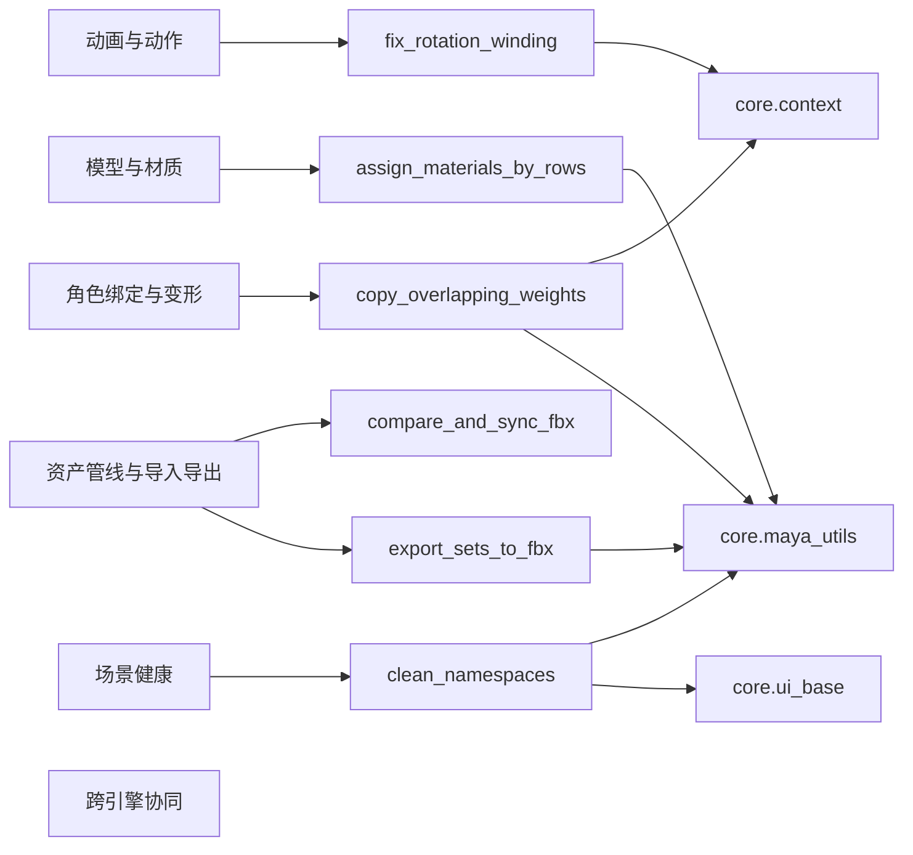

<!-- Generated by scripts/sync_obsidian_knowledge.py. Edit source files instead. -->
# 项目结构图

```mermaid
flowchart LR
    domain_animation["动画与动作"]
    domain_rigging["角色绑定与变形"]
    domain_modeling_surfacing["模型与材质"]
    domain_pipeline_io["资产管线与导入导出"]
    domain_scene_hygiene["场景健康"]
    domain_engine_bridge["跨引擎协同"]
    tool_assign_materials_by_rows["assign_materials_by_rows"]
    domain_modeling_surfacing --> tool_assign_materials_by_rows
    core_maya_utils["core.maya_utils"]
    tool_assign_materials_by_rows --> core_maya_utils
    tool_clean_namespaces["clean_namespaces"]
    domain_scene_hygiene --> tool_clean_namespaces
    core_maya_utils["core.maya_utils"]
    tool_clean_namespaces --> core_maya_utils
    core_ui_base["core.ui_base"]
    tool_clean_namespaces --> core_ui_base
    tool_compare_and_sync_fbx["compare_and_sync_fbx"]
    domain_pipeline_io --> tool_compare_and_sync_fbx
    tool_copy_overlapping_weights["copy_overlapping_weights"]
    domain_rigging --> tool_copy_overlapping_weights
    core_context["core.context"]
    tool_copy_overlapping_weights --> core_context
    core_maya_utils["core.maya_utils"]
    tool_copy_overlapping_weights --> core_maya_utils
    tool_export_sets_to_fbx["export_sets_to_fbx"]
    domain_pipeline_io --> tool_export_sets_to_fbx
    core_maya_utils["core.maya_utils"]
    tool_export_sets_to_fbx --> core_maya_utils
    tool_fix_rotation_winding["fix_rotation_winding"]
    domain_animation --> tool_fix_rotation_winding
    core_context["core.context"]
    tool_fix_rotation_winding --> core_context
```

箭头表示正式工具所属领域及代码中的直接公共模块引用。它不表示工具执行顺序。
